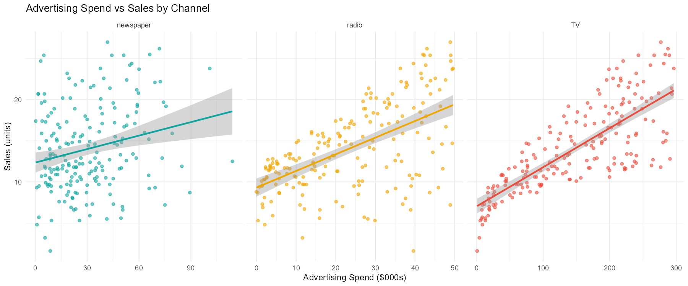
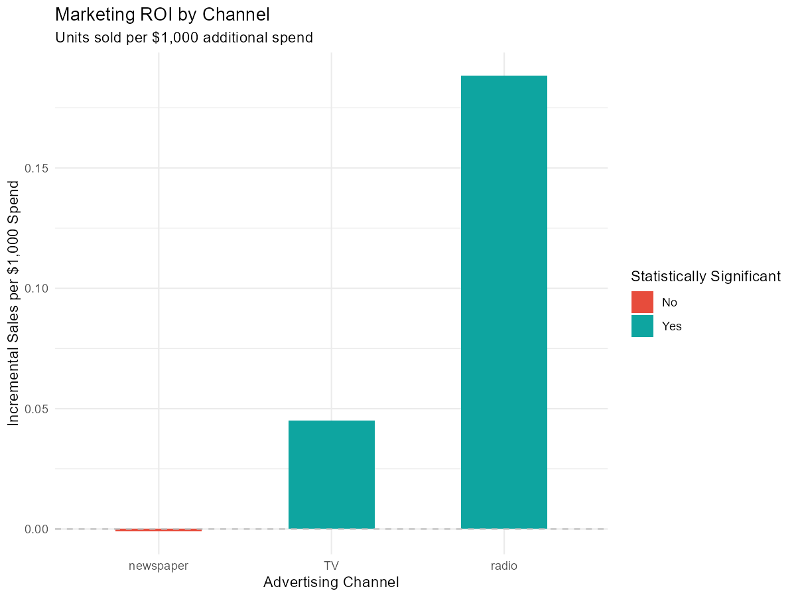
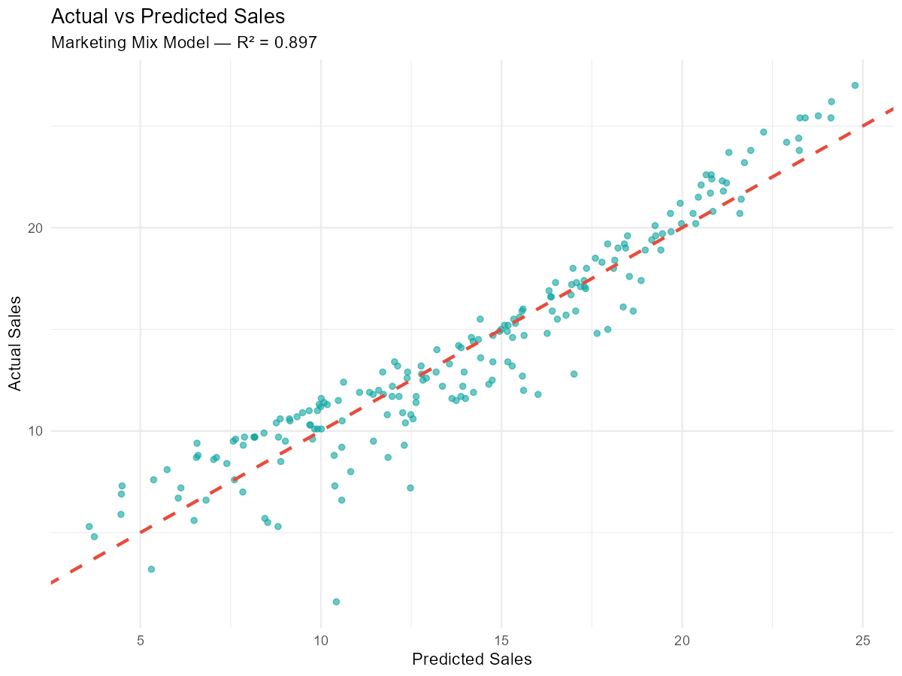
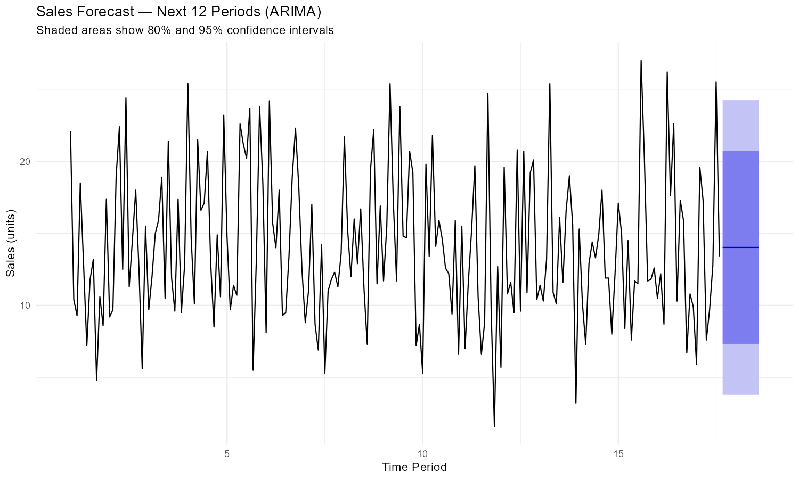

# 📊 Marketing Mix Model — Advertising Spend & Sales Analysis

## Built a Marketing Mix Model to support data-driven budget allocation decisions, identifying high-ROI channels and improving marketing efficiency.

**Tools:** R (tidyverse, forecast, lmtest, corrplot) | **Skills:** Multivariate Regression, ARIMA, Time Series, Marketing Analytics, Data Visualization

---

## 📌 Business Problem

A company is investing across three advertising channels — TV, Radio, and Newspaper — but doesn't know which channels are actually driving sales. The goal is to build a **Marketing Mix Model (MMM)** to:

- Quantify the impact of each advertising channel on sales
- Calculate ROI per dollar spent across channels
- Identify underperforming channels for budget reallocation
- Forecast future sales using time series modeling

This is the core analytical work performed by marketing analytics consultancies for Fortune 500 clients.

---

## 📊 Dataset

- **Source:** Classic Advertising dataset (ISLR — Introduction to Statistical Learning)
- **Size:** 200 markets, 4 variables
- **Variables:**
  - `TV` — TV advertising spend ($000s)
  - `Radio` — Radio advertising spend ($000s)
  - `Newspaper` — Newspaper advertising spend ($000s)
  - `Sales` — Units sold (000s)
  
While this analysis uses a standard dataset for demonstration, the methodology replicates real-world marketing mix modeling used in industry settings.
---

## 🔍 Key Findings

### Key Insight

#### Radio advertising delivers ~4x higher ROI than TV despite lower correlation with sales, highlighting the importance of distinguishing between correlation and causal impact when allocating marketing budgets.

### 1. Channel Correlation with Sales

| Channel | Correlation | Strength |
|---|---|---|
| **TV** | 0.782 | Strong positive ✅ |
| **Radio** | 0.576 | Moderate positive ✅ |
| **Newspaper** | 0.228 | Weak positive ⚠️ |

TV advertising has the strongest linear relationship with sales across all 200 markets.

### 2. Marketing Mix Model Results

**Model:** Multivariate OLS Regression
**R-squared: 0.897** — the three channels together explain **89.7% of all sales variation**

```
Sales = 2.939 + 0.045(TV) + 0.189(Radio) - 0.001(Newspaper)
```

| Channel | Coefficient | ROI per $1,000 | Significant? |
|---|---|---|---|
| **TV** | 0.045 | +45 units | ✅ Yes (***) |
| **Radio** | 0.189 | +189 units | ✅ Yes (***) |
| **Newspaper** | -0.001 | -1 unit | ❌ No |

### 3. The Surprising Finding — Radio Beats TV on ROI

While TV has the strongest **correlation** with sales, Radio delivers **4x higher ROI** per dollar spent:
- TV: 0.045 units per $1,000
- Radio: 0.189 units per $1,000

This distinction between correlation and incremental ROI is critical for budget optimization decisions.

### 4. ARIMA Forecast

- **Model selected:** ARIMA(0,0,0) — white noise process
- Sales variation is driven by **advertising spend levels**, not temporal patterns
- This confirms regression-based MMM is more appropriate than pure time series forecasting for cross-sectional market data
- Note: STL decomposition was not applied as the dataset is cross-sectional (200 markets) rather than sequential time series data. A real-world implementation would use longitudinal sales data with sufficient seasonal cycles.

---

## 💡 Business Recommendations

**1. Reallocate Newspaper budget to Radio**
Newspaper is not statistically significant and shows a slightly negative coefficient. Every dollar shifted from Newspaper to Radio delivers a measurable sales uplift.

**2. Maintain TV investment for brand awareness**
While TV's incremental ROI is lower than Radio, its strong correlation (0.782) suggests it plays an important role in overall brand awareness and market presence.

**3. Optimal budget mix**
> Heavy Radio investment + Strong TV presence + Zero Newspaper spend

**4. Model deployment**
With R² = 0.897, this model is robust enough to simulate budget scenarios — inputting proposed spend levels to forecast expected sales outcomes before committing budget.

---

## 📁 Project Structure

```
marketing-mix-model/
│
├── marketing_mix_model.R        # Full analysis script
├── README.md                    # Project documentation
├── sales_distribution.png       # Sales distribution histogram
├── channel_vs_sales.png         # Scatter plots by channel
├── correlation_matrix.png       # Correlation heatmap
├── actual_vs_predicted.png      # Model fit visualization
├── roi_by_channel.png           # ROI comparison chart
└── sales_forecast.png           # ARIMA forecast chart
```

---

## 📈 Visualizations

### Channel vs Sales


### ROI by Channel


### Actual vs Predicted


### Sales Forecast (ARIMA)


---

## 🚀 How to Run

```r
# Install required packages
install.packages(c("tidyverse", "forecast", "lmtest", "corrplot", "scales", "readr"))

# Run the full analysis
source("marketing_mix_model.R")
```

---

## 🔗 Skills Demonstrated

- **Multivariate regression** — OLS marketing mix modeling
- **Statistical significance testing** — identifying which channels matter
- **ROI analysis** — quantifying incremental return per dollar spent
- **Time series modeling** — ARIMA forecasting
- **Data visualization** — ggplot2 charts for client presentations
- **Business insight generation** — translating statistical output into actionable recommendations
- **Methodological rigor** — understanding when to apply (and not apply) specific techniques

---

*Built as part of a marketing analytics portfolio targeting econometric consulting roles.*